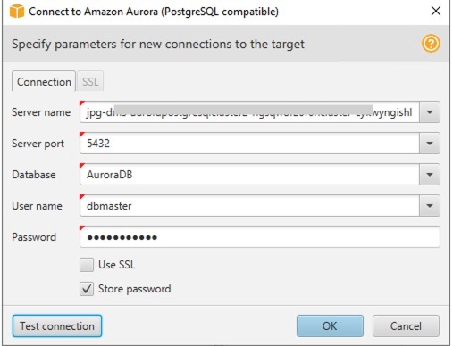

# Convert DB2 to Aurora Postgres

## Purpose

Demo converting DB2 database to postgresql using DB2 on an EC2 instance with SCT and DMS.  Additional option to use Kinesis in between DMS and Aurora.


&nbsp;

## Outline

- [Overview](#overview)
- [AWS Services Used](#aws-services-used)
- [Technical Overview](#technical-overview)
- [Instructions](#instructions)
  - [Create Environment](#create-environment)
  - [Edit Security Group Settings](#edit-security-group-settings)
  - [Setup VNC](#setup-vnc)
  - [Troubleshoot VNC](#troubleshoot-vnc)
- [DB2 Setup](#db2-setup)
  - [Install Pre-requisite Libraries](#install-prerequisite-libraries)
  - [Download DB2](#download-db2)
  - [Install DB2](#install-db2)
  - [Troubleshoot DB2 install](#troubleshoot-vnc)
  - [DB2 sample database](#db2-sample-database)
  - [Setup VNC for db2inst1](#setup-vnc-for-db2inst1)
- [Windows Steps](#windows-steps)
  - [Install Windows DB2 Client](#install-windows-db2-client)
  - [Install IBM Data Studio](#install-ibm-data-studio)
  - [Install git](#install-git)
  - [SCT](#sct)
  - [Troubleshooting Windows](#troubleshooting-windows)
- [DB2 with DMS](#db2-with-dms)
  - [DB2 Replication](#db2-replication)
  - [DB2 Drop Foreign Keys](#db2-drop-foreign-keys)
- [Create DMS Resources](#create-dms-resources)
   
- [Cleaning up](#cleaning-up)
  

&nbsp;

## Overview

Use CloudFormation template from [Data Migration Immersion Day](https://dms-immersionday.workshop.aws/en).
  Add an IBM DB2 instance and demo using SCT/DMS to convert DB2 sample database to Aurora PostgreSQL.

## AWS Services Used

* [AWS DMS Database Migration Service](https://aws.amazon.com/dms/)
* [AWS SCT Schema Conversion Tool](https://aws.amazon.com/dms/schema-conversion-tool/)
* [AWS Cloudformation](https://aws.amazon.com/cloudformation/)
* [AWS DMS Workshop](https://dms-immersionday.workshop.aws/en)
* [Amazon Kinesis](https://aws.amazon.com/kinesis)

## Technical Overview

* Bring up DMS/SCT environment using modified immersion days template
* Review Security Group Settings
* Setup VNC viewer on redhat instance.  VNC is needed for using IBM DB2 Setup Wizard
* A db2 installation response file is available for a silent install to avoid need for VNC
* Install DB2 and create sample DB2 database
* Use SCT and DMS to convert sample DB2 database to Aurora PostgreSQL

&nbsp;

---

&nbsp;

## Instructions

***IMPORTANT NOTE**: Creating this demo application in your AWS account will create and consume AWS resources, which **will cost money**.  Costing information is available at [AWS DMS Pricing](https://aws.amazon.com/dms/pricing/)   The template will cost money for the other resources as well.

**ADDITIONAL NOTE**: Latest IBM DB2 version supported as of January 2021 is 11.1 with all Fix Packs.  I worked through the entire process using IBM DB2 v11.5 and everything works until the very last step to move the data with DMS.  This step fails to find the DB2 tables and no data is moved.
DB2 11.5 is not supported by DMS and there is not an ETA for that support.  Free trial downloads of earlier DB2 version are not available. 
I successfully used DB2 11.1 FixPack 5 for this exercise.  I am unclear on usage limitation with this downloadable content so use this at your own discression.

&nbsp;

### Create Environment

* Start with [AWS Account instructions](https://dms-immersionday.workshop.aws/en/envconfig/regular.html)
* After reviewing  "Introduction" and "Getting Started", follow the Regular AWS Account instructions. 
* Complete the "Login to the AWS Console" and "Create an EC2 Key Pair" steps
* In the "Configure the Environment" step, use the provided ./templates/DMSWorkshop.yaml file instead of the link.  Choose SQL Server for the source database

### Edit Security Group Settings
Additional ports need to be open to allow VNC connectivity to the redhat 8 instance to install DB2.  Additionally, using additional agents for DMS, can require additional ports to be open
* Find the security group.  There are two security group created with the template.  Click on the InstanceSecurityGroup (not the DMSSecurityGroup)
* Tighten security on the RDP rule.  Currently it is open to public 
    * two choices-can open the ports to amazon ip using the amazon VPN.  *problem* vnc will not work while on amazon VPN.  vnc is needed for DB2 install.
        * it is best to log out of amazon vpn and use the non-amazon ip address
        * get amazon ip address using [amazon checkip URL](http://checkip.amazonaws.com) 
        * get ip address using a "get my ip" search
        * a separate option is to use tightvnc client on the windows VM (vnc viewer is flaky on windows)
    * Click "Edit Inbound Rules"
    * on the RDP inbound rule, remove "0.0.0.0/16" and put in the address obtained in checkip with a /32  e.g.  "1.2.3.4/32"
    * open all internal communication on private.  Easy way is to change the inbound rule with Access Type of Oracle-RDS to All TCP.
    * Click Add Rule and add a new rule for VNC access from the address found in checkip.  Use port range of 5900-6000
    * Click Add Rule and add a new rule for SSH access from the address found in checkip.  Use inbound rule type "SSH"
    * Click "save rules"

### Setup VNC
VNC is needed to do the IBM install on the redhat instance unless a silent install is chosen with the response file.  If using silent install, this section on VNC setup can be skipped.  I have provided a response file in this github at [db2 install response file](https://github.com/jphaugla/awsDB2ToAuroraPostgres/blob/main/db2server.rsp)
This could eliminate the need for VNC.  Additionally, there is db2_install script which may work without VNC.  I have not verified either of these approaches so these instructions require VNC setup.

To login from client to redhat instance
```bash
ssh -i keypairFile ec2-user@redhatIPaddress
```
* Install needed packages to redhat instance- NOTE:  git is not needed for VNC but needed for later
```bash
sudo yum groupinstall 'Server with GUI'
sudo yum install pixman pixman-devel
sudo yum -y install tigervnc-server git
``` 
* change ssd to allow password login with ssh
```bash
sudo vi /etc/ssh/sshd_config
Set the ChallengeResponseAuthentication yes
Set the PasswordAuthentication yes
# save the file
# restart sshd
sudo systemctl restart sshd.service
``` 
* disable firewalld
```bash
sudo systemctl stop firewalld
sudo systemctl disable firewalld
```
* define port 1 for ec2-user
```bash
sudo bash
echo ":1=ec2-user" >> /etc/tigervnc/vncserver.users
```
* set up VNC password as ec2-user
```bash
vncpasswd
Password:
Verify:
Would you like to enter a view-only password (y/n)? n
```
* set up an os password for ec2-user  probably easier if you choose same password as VNC password
(be logged in as ec2-user)
```bash
sudo passwd ec2-user
```
* add a vnc config file as ec2-user 
```bash
echo "session=gnome" >> ~/.vnc/config
echo "alwaysshared" >> ~/.vnc/config
```
* ensure these two lines in  /etc/tigervnc/vncserver-config-mandatory
```bash
session=gnome
alwaysshared
```
* setup mandatory vncserver 
* change vi /etc/gdm/custom.conf under the default section
WaylandEnable=false
DefaultSession=gnome-xorg.desktop
* start and enable tigervnc
```bash
sudo systemctl start vncserver@:1
sudo systemctl enable vncserver@:1
sudo systemctl set-default graphical
```
* follow [disable se linux URL](https://access.redhat.com/documentation/en-us/red_hat_enterprise_linux/6/html/security-enhanced_linux/sect-security-enhanced_linux-enabling_and_disabling_selinux-disabling_selinux)

### Troubleshoot VNC

* Check the vnc process to ensure it is fully running

```bash
sudo systemctl status vncserver@:1
● vncserver@:1.service - Remote desktop service (VNC)
   Loaded: loaded (/usr/lib/systemd/system/vncserver@.service; enabled; vendor preset: disabled)
   Active: active (running) since Tue 2021-01-05 02:37:52 UTC; 26s ago
  Process: 2599 ExecStart=/usr/libexec/vncsession-start :1 (code=exited, status=0/SUCCESS)
 Main PID: 2605 (vncsession)
    Tasks: 1 (limit: 98872)
   Memory: 1.8M
   CGroup: /system.slice/system-vncserver.slice/vncserver@:1.service
           ‣ 2605 /usr/sbin/vncsession ec2-user :1

Jan 05 02:37:52 xxxxx.ec2.internal systemd[1]: Starting Remote desktop service (VNC)...
Jan 05 02:37:52 xxxxx.ec2.internal systemd[1]: Started Remote desktop service (VNC). 
```
* [Redhat 8 PDF on gnmome and remote access](https://access.redhat.com/documentation/en-us/red_hat_enterprise_linux/8/pdf/using_the_desktop_environment_in_rhel_8/Red_Hat_Enterprise_Linux-8-Using_the_desktop_environment_in_RHEL_8-en-US.pdf)
* screen saver lock out says "Cloud User"  this is actually ec2-user so enter the OS password for ec2-user
* TightVNC on windows is easiest connection (VNC Viewer on windows did not work)
* VNC Viewer on Mac seems to work but not with Amazon VPN so it becomes inconvenient especially with mac port used in security group

## DB2 Setup

### install prerequisite libraries
```bash
sudo bash
yum install -y libstdc++.i686
yum install -y pam.i686
yum install -y gcc-c++ cpp gcc kernel-devel make patch
yum install -y libaio
```
DB2 needs VNC to do the install with the setup wizard.  There is also a silent option not needing vnc with a response file.  In the github home the response file is [db2response](https://github.com/jphaugla/awsDB2ToAuroraPostgres/blob/main/db2server.rsp)

### Download DB2

* NOTE:  At the time, db2 11.1 fixpack 5 is most recent version supported by AWS DBS 
* Using the VNC connection to the IBM server, go to download page for DB2 software [DB2 software](https://www.ibm.com/support/pages/download-db2-fix-packs-version-db2-linux-unix-and-windows)
    * an IBMID will be needed for this (it is free)
* Scroll down to "DB2 Fix Packs" button and click on the version    
* Scroll down and click the download link for 
* Scroll down on this page to find the    
* Download the file.  This is the name of the file:  v11.1.4fp5_linuxx64_server_t.tar.gz 
* create holding file for DB2 Software (not necessary but makes later documentation easier)
```bash
sudo bash
cd /home
mkdir software
chmod 777 software
exit
```
* Move the downloaded db2 installation file to the /home/software and decompress the file using tar -xvzf 
* rename directory so what was the server_t directory becomes ibm-db2 
```bash
sudo bash
cd /home/softare
tar -xvzf "tar file name"
mv server_t ibm-db2
```

### Install DB2
There are two ways to do this.  Both methods use db2setup.  If VNC is setup use the setup wizard by starting db2setup with any parameters.  If VNC is not available, do a silent install using the provided db2 response file in the [github](https://github.com/jphaugla/awsDB2ToAuroraPostgres/blob/main/db2server.rsp)

* Do a root based install using ./db2setup 
* If VNC is available
```bash
sudo bash
cd /home/software/ibm-db2/
./db2setup
```
* if VNC is not available
    * copy db2server.rsp file to redhat server
```bash
ssh -i "path to ssh key file" db2server.rsp ec2-user@"ip address for node":/home/software/ibm-db2
```
    * run db2setup with response file
```bash
sudo bash
cd /home/software/ibm-db2/
./db2setup -r db2server.rsp
# must set a password for db2inst1 user
passwd db2inst1
```
* db2 validation
```bash
sudo bash
su - db2inst1
db2val
```

### Troubleshoot DB2 install
* this IBM link [IBM troubleshoot](https://www.ibm.com/support/knowledgecenter/en/SS4KMC_2.5.0/com.ibm.ico.doc_2.5/c_ts_installation.html) is helpful.  Odd that it says to ignore the 32 bit libraries.
* here are some maybe overly complex install instructions [complex install instructions](https://www.ibm.com/support/producthub/db2/docs/content/SSEPGG_11.5.0/com.ibm.db2.luw.qb.server.doc/doc/t0008875.html)
* the DB2 install is hard to fix if there is a mistake.  It is easier to re-install
* To re-install DB2, make sure everything is deleted.  These [delete steps](https://www.ibm.com/support/knowledgecenter/SSEPGG_11.5.0/com.ibm.db2.luw.qb.server.doc/doc/t0007439.html) help but are not complete.

```bash
sudo bash
su - db2inst1
db2 drop database sample
exit
#  now back as root
# get DB2 scripts in the profile
. /home/db2inst1/sqllib/db2profile
cd /opt/ibm/db2/V11.1
db2stop force
db2 terminate
/opt/ibm/db2/V11.1/instance/db2idrop db2inst1
/opt/ibm/V11.1/install/db2_deinstall -a 
# if you don't delete this user, db2 will create db2inst2
# if you don't remove the home directory, the files are left owned by previous UID causing problems
userdel db2inst1
userdel db2fenc1
rm -rf /home/db2inst1
rm -rf /home/dbfenc1
rm -rf /opt/ibm/db2/V11.1
```

### DB2 sample database
* create sample database.  For more information look at documentation sample database [db2sampl](https://www.ibm.com/support/knowledgecenter/SSEPGG_11.5.0/com.ibm.db2.luw.admin.cmd.doc/doc/r0001934.html)

```bash
sudo bash
su - db2inst1
db2sampl
```

* get familiar with DB2 and sample database using this [document](https://www.tutorialspoint.com/db2/db2_quick_guide.htm)  The install directions are dated but the rest is very good. Be careful what steps you run as some of these commands are "impactful"

### Setup VNC for db2inst1

This is a very optional step but handy for using VNC type tools with db2inst1.  Only do this if VNC was configured above

* define port 2 for db2inst1
```bash
sudo bash
echo ":2=db2inst1" >> /etc/tigervnc/vncserver.users
```
* set up VNC password as db2inst1
(be logged in as db2inst1)
```bash
vncpasswd
Password:
Verify:
Would you like to enter a view-only password (y/n)? n
```

* start and enable tigervnc second session

```bash
sudo systemctl start vncserver@:2
sudo systemctl enable vncserver@:2
sudo systemctl set-default graphical
```

## Windows Steps

### Install Windows DB2 Client

* download free trial download [db2 trials](https://www.ibm.com/analytics/db2/trials)
* click on download for free
* select "Microsoft Windows(x64) Download"
* expand the software zip file
* expand in software tree to find "setup.exe" and double click
* find "Install Data Server Client".  follow prompts to install

### Install IBM Data Studio

* On Windows machine, download IBM Data Studio client software [Download Data Studio](https://mrs-ux.mrs-prod-7d4bdc08e7ddc90fa89b373d95c240eb-0000.us-south.containers.appdomain.cloud/marketing/iwm/platform/mrs/assets/DownloadList?source=swg-idside&lang=en_US)
* Click on download link for Windows
* After download completes, expand the zip file
* Within the ibm_ds4130_win folder, Double-click the launchpad.exe and follow the prompts to install

### Install git

Git is needed to pull this repository onto the windows machine.  The repository has some needed scripts.
* Got to the [git download](https://git-scm.com/) 
* Download the latest git release for windows
* Double-click on the git exe file and follow the prompts to install
* clone the git project using a windows DOC command line

```bash
cd "Desktop\DMS Workshop"
git clone https://github.com/jphaugla/awsDB2ToAuroraPostgres.git
```

### SCT

Return back to the DMS and SCT steps using the SQL Server to Amazon Aurora PostgreSQL

* Start back at this point in the [guide](https://dms-immersionday.workshop.aws/en/sqlserver-aurora-postgres.html)
* Perform the following Part 1 Schema Conversion Steps: "Connect to the EC2 Instance", "Install the AWS Schema Conversion Tool (AWS SCT)"
* Restart the Windows Server (this seems to be important after the SCT install)
* Create a New Project using New Project Wizard 
* Connect to DB2 
* Accept the risks
* Click on the "DB2INST1" instance on the left panel and click "Next" to generate the assessment report
* Click Next and enter parameters for Aurora PostgreSQL connection 
    * To find the password, look back in the original templates/DMSWorkshop.yaml in the repository home
    * Click "Finish"
* Right click on the "DB2INST1" database in the left panel and select Convert Schema to generate the data definition language (DDL) statements for the target database.
* Right click on the db2inst1 schema in the right-hand panel, and click Apply to database. click Yes
* Can see the tables now in the target database.  Use the pg4admin tool to verify the new schema exists but is not populated.

### Troubleshooting Windows

* if can't connect through ports
    * Disable Windows Defender [Disable Defender](https://support.microsoft.com/en-us/windows/turn-microsoft-defender-firewall-on-or-off-ec0844f7-aebd-0583-67fe-601ecf5d774f)
    * Restart the windows machine (yep, it is not 1995 but restarting a windows machine never hurts!)
 
## DB2 with DMS

Several links for background on changes needed for DB2 setup with DMS

* Link for using IBM DB2 as a source for DMS [DB2 DMS](https://docs.aws.amazon.com/dms/latest/userguide/CHAP_Source.DB2.html) 
* Link for changing logarchmeth1 on db2 11.5 [Turn on Log](https://www.ibm.com/support/knowledgecenter/SSEPGG_11.5.0/com.ibm.db2.luw.admin.config.doc/doc/r0011448.html)
* Link to change Configuration Parameters.  [Configuration Parameter Change](https://www.ibm.com/support/knowledgecenter/en/SSEPGG_11.5.0/com.ibm.db2.luw.admin.config.doc/doc/t0005243.html)
* NOTE:  LOGARCHMETH1 and LOGARCHMETH2 are for newer versions of DB2.  Older versions use LOGRETAIN

### DB2 Replication

Choose most comfortable method for making the configuration parameter.  Following steps are using a command line unix connection

* Turn on replication from unix connection to the redhat Db2 instance

```bash
su - db2inst1
db2 connect to sample
# turn replication on
db2 update db cfg for sample using logarchmeth1 logretain
# database must be deactivated and reactivated.  THis is the easiest method but less aggressive methods may also work
db2stop 
# if this does not work and this message appears "SQL1025N  The database manager was not stopped because databases are still active."
db2stop force
# restart
db2start
# backup must be taken once logretain is enabled or following error will be returned "SQL1116N A connection to or activation of the database cannot be made because of BACKUP PENDING."
db2 backup database sample
```

### DB2 Drop Foreign Keys
Open the pgadmin tool by clicking on the elephant icon on the bottom of the windows server
This is very similar to the immersion day Configure the Target DataBase step [Configure Target](https://dms-immersionday.workshop.aws/en/sqlserver-aurora-postgres/data-migration/config-target/config-target.html) but using the drop_constraints from the git repo

* Using the tree structure on the left, find the AuroraDB database and then the db2inst1 schema and click on the schema
* Use Tools->Query Tool to open the query tool
* click on the "open folder" icons on far left of the icons for pagamin query tool and open the drop_constraints script
    * the script is at C:\Users\Administrator\Desktop\DMS Workshop\awsDB2ToAuroraPostgres\scripts\drop_constraints.sql

## Create DMS Resources

Some choices here.  In addition can add a separate Migration Task for using the same DB2 source tables but the target endpoint is Kinesis.  In this scenario, there are no mapping rules but a separate Kinesis stream is needed for each table.  The streams are defined in the cloud formation template as well.

### Create DMS Replication Instance 

* Follow steps from [immersion training](https://dms-immersionday.workshop.aws/en/sqlserver-aurora-postgres/data-migration/replication-instance/replication-instance.html)

### Create DMS Endpoints 

* Follow these [Steps](https://dms-immersionday.workshop.aws/en/sqlserver-aurora-postgres/data-migration/endpoints/endpoints.html) 
* Use these parameters for the source 
* THe specific PostgreSQL endpoints, KinesisEndpoints and TargetKinesis roles are output in the cloudformation

### Create a [DMS Replication Task](https://dms-immersionday.workshop.aws/en/sqlserver-aurora-postgres/data-migration/migration-task/migration-task.html)

* add a selection rule where schema name is like "DB2INS%"
* DB2 uses upper case schema, table, and column names so these must all be converted in mapping rules
* add 3 separate mapping rules for columns, tables and schema

```bash
where schema name is like '%' and table name is like '%', convert-lowercase
where schema name is like '%' and table name is like '%', convert-lowercase
where schema name is like '%'  convert-lowercase
```

* Still not getting any DB2 table with a clob to successfully transfer-have not debugged that at this time
* This is the error if 11.5 is used

```bash
2021-01-08T01:36:14 [TASK_MANAGER ]E: No tables were found at task initialization. Either the selected table(s) no longer exist or no match was found for the table selection pattern(s). [1021707] (replicationtask.c:2107)
```

### Cleaning up

Remove all files from S3 to avoid accruing unnecessary charges

&nbsp;

---

&nbsp;
